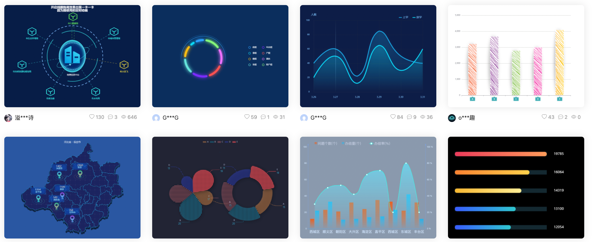

## 项目介绍

- 应对现在数据可视化的趋势，越来越多企业需要在很多场景(营销数据，生产数据，用户数据)下使用，可视化图表来展示体现数据，让数据更加直观，数据特点更加突出。

- 项目以黑马班级管理为背景，功能包括学生信息录入，每次成绩录入；并制作可视化看板。

- 我们以班主任老师的角色注册账号，并登录系统。

- 为了方便开发，登录后点击页面顶部的“点我初始化数据”按钮，即可为该账号随机增加56名同学（8个小组，每组7人），并为每位学生模拟了3次考试成绩。

- 后续，可以在学员管理中，增删改学员信息，也可以录入或修改成绩。

## 重要的三个地址

- **接口文档地址**：https://docs.apipost.cn/preview/ebfa24f6d27e4f89/cf3af015f5ca6674
- **接口根路径**：http://www.itcbc.com:8000
- **线上演示地址**：http://www.itcbc.com:8888/login.html

## 资源说明

- 仓库地址：https://gitee.com/laotang1234/data-visualization-211025

  - master 默认模板
  - dev 包括完整功能

  ```bash
  # 克隆master分支
  git clone git@gitee.com:laotang1234/data-visualization-211025.git
  或
  git clone https://gitee.com/laotang1234/data-visualization-211025.git
  
  # 克隆dev分支
  git clone -b dev git@gitee.com:laotang1234/data-visualization-211025.git
  或
  git clone -b dev https://gitee.com/laotang1234/data-visualization-211025.git
  ```

## 课程目标

- 实战Ajax在项目中的应用
- 掌握echarts的基本使用
- 增强对数据的处理能力，增强编程能力

## Echarts-介绍

> ECharts，一个使用 JavaScript 实现的开源可视化库，可以流畅的运行在 PC 和移动设备上，兼容当前绝大部分浏览器（IE8/9/10/11，Chrome，Firefox，Safari等），底层依赖矢量图形库 [ZRender](https://github.com/ecomfe/zrender)，提供直观，交互丰富，可高度个性化定制的数据可视化图表。

大白话：

- 是一个JS插件
- 性能好可流畅运行PC与移动设备
- 兼容主流浏览器
- 提供很多常用图表，且可**定制**。

## Echarts-体验

官方教程：[五分钟上手ECharts](https://echarts.apache.org/handbook/zh/get-started/)

自己步骤：

- 下载echarts  https://echarts.apache.org/zh/download.html
- 引入echarts  `dist/echarts.min.js`
- 准备一个具备大小（宽高）的 DOM

```html
<div id="main" style="width: 600px;height:400px;"></div>
```

- 初始化echart实例

```js
var myChart = echarts.init(document.getElementById('main'));
```

- 指定图表的配置项和数据 (根据文档提供示例找到option)

```js
var option = {
    xAxis: {
        type: 'category',
        data: ['Mon', 'Tue', 'Wed', 'Thu', 'Fri', 'Sat', 'Sun']
    },
    yAxis: {
        type: 'value'
    },
    series: [{
        data: [820, 932, 901, 934, 1290, 1330, 1320],
        type: 'line'
    }]
};
```

- 使用刚指定的配置项和数据显示图表

```js
myChart.setOption(option);
```

## Echarts-基础配置

> 需要了解的主要配置：`series` `xAxis` `yAxis` `grid` `tooltip` `title` `legend` `color` 

- series
  - 系列列表。每个系列通过 `type` 决定自己的图表类型
  - 大白话：图标数据，指定什么类型的图标，可以多个图表重叠。
- xAxis：直角坐标系 grid 中的 x 轴
- yAxis：直角坐标系 grid 中的 y 轴
- grid：直角坐标系内绘图网格
- title：标题组件
- tooltip：提示框组件
- legend：图例组件
- color：调色盘颜色列表

演示代码：

```js
var option = {
    xAxis: {
        type: 'category',
        data: ['Mon', 'Tue', 'Wed', 'Thu', 'Fri', 'Sat', 'Sun']
    },
    yAxis: {
        type: 'value'
    },
    series: [{
        data: [820, 932, 901, 934, 1290, 1330, 1320],
        type: 'line',
        name:'线形图'
    },
    {
        data: [22, 333, 111, 222, 444, 666, 777],
        type: 'bar',
        name:'饼状图'
    }],
    grid: {
        show: true
    },
    title: {
        text: '标题'
    },
    tooltip: {
        padding: 20
    },
    legend: {
        data: ['线形图']
    },
    color: ['red','green']
};
```

## Echarts-饼图

### 步骤分析

1. 封装好函数，为后续传入真实数据做准备
2. 初始化echarts
3. 设置配置项，空的 option 即可
4. 创建图表
5. 查找官方示例
6. 按需求，自定义配置图表

### 第一步：echarts基本步骤

```js
function pieChart() {
  let myChart = echarts.init(document.querySelector('.pie'));
	let option = {};
	myChart.setOption(option);
}
```


### 第二步：参照官方示例

（官方示例：https://echarts.apache.org/examples/zh/editor.html?c=pie-roseType-simple）

```js
option = {
  series: [
    {
      name: 'Nightingale Chart',
      type: 'pie',
      radius: [50, 250],
      center: ['50%', '50%'],
      roseType: 'area',
      itemStyle: {
        borderRadius: 8
      },
      data: [
        { value: 40, name: 'rose 1' },
        { value: 38, name: 'rose 2' },
        { value: 32, name: 'rose 3' },
        { value: 30, name: 'rose 4' },
        { value: 28, name: 'rose 5' },
        { value: 26, name: 'rose 6' },
        { value: 22, name: 'rose 7' },
        { value: 18, name: 'rose 8' }
      ]
    }
  ]
};
```

### 第三步：自定义配置

- 增加标题，标题颜色 #6d767e
- 增加鼠标移入提示。
- 系列数据
  - 修改 name 为 '各地人员分布'
  - 饼图，内圈半径 10%，外圈半径 60%
  - 居中显示
  - 半径模式
  - 扇形轮廓圆角（3px）

## Echarts-折线图

### 步骤分析

1. 封装好函数，为后续传入真实数据做准备
2. 初始化echarts
3. 设置配置项，空的option 即可
4. 创建图表
5. 查找官方示例
6. 按需求，自定义配置图表

### 第一步：echarts基本步骤

```js
function lineChart() {
  let myChart = echarts.init(document.querySelector('.line'));
  let option = {};
  myChart.setOption(option);
}
```


### 第二步：参照官方示例

（官方示例：https://echarts.apache.org/examples/zh/editor.html?c=area-simple）

```js
option = {
  tooltip: {
    trigger: 'axis',
    position: function (pt) {
      return [pt[0], '10%'];
    }
  },
  title: {
    left: 'center',
    text: 'Large Area Chart'
  },
  xAxis: {
    type: 'category',
    boundaryGap: false,
    data: ['a', 'b', 'c', 'd', 'e', 'h', 'j', 'k', 'm']
  },
  yAxis: {
    type: 'value',
    boundaryGap: [0, '100%']
  },
  dataZoom: [
    {
      type: 'inside',
      start: 0,
      end: 10
    },
    {
      start: 0,
      end: 10
    }
  ],
  series: [
    {
      name: 'Fake Data',
      type: 'line',
      symbol: 'none',
      data: [3, 5, 2, 9, 8, 1, 8, 7, 4]
    }
  ]
};
```

### 第三步：自定义配置

- 增加标题，靠左对齐，标题颜色 #6d767e
- 分析tooltip（官方示例已带）。
- 系列数据
  - 增加一条线
  - 修改 name 为 '期望薪资' 和 '实际薪资'
  - 线的拐点为平滑拐点
  - 线条和X轴对齐位置，无特殊标记
- 增加图例
- X轴刻度线和文字（标签）对齐

## Echarts-柱状图

### 步骤分析

1. 封装好函数，为后续传入真实数据做准备
2. 初始化echarts
3. 设置配置项，空的option 即可
4. 创建图表
5. 查找官方示例
6. 按需求，自定义配置图表

### 第一步：echarts基本步骤

```js
function barChart() {
  let myChart = echarts.init(document.querySelector('.barChart'));
  let option = {}
  myChart.setOption(option);
}
```


### 第二步：参照官方示例

（官方示例：https://echarts.apache.org/examples/zh/editor.html?c=mix-line-bar）

```js
option = {
  tooltip: {
    trigger: 'axis',
    axisPointer: {
      type: 'cross',
      crossStyle: {
        color: '#999'
      }
    }
  },
  legend: {
    data: ['Evaporation', 'Precipitation']
  },
  xAxis: [
    {
      type: 'category',
      data: ['Mon', 'Tue', 'Wed', 'Thu', 'Fri', 'Sat', 'Sun'],
      axisPointer: {
        type: 'shadow'
      }
    }
  ],
  yAxis: [
    {
      type: 'value',
      name: 'Precipitation',
      min: 0,
      max: 250,
      interval: 50,
      axisLabel: {
        formatter: '{value} ml'
      }
    },
    {
      type: 'value',
      name: 'Temperature',
      min: 0,
      max: 25,
      interval: 5,
      axisLabel: {
        formatter: '{value} °C'
      }
    }
  ],
  series: [
    {
      name: 'Evaporation',
      type: 'bar',
      data: [
        2.0, 4.9, 7.0, 23.2, 25.6, 76.7, 135.6, 162.2, 32.6, 20.0, 6.4, 3.3
      ]
    },
    {
      name: 'Precipitation',
      type: 'bar',
      data: [
        2.6, 5.9, 9.0, 26.4, 28.7, 70.7, 175.6, 182.2, 48.7, 18.8, 6.0, 2.3
      ]
    }
  ]
};
```

### 第三步：自定义配置

- 多个Y轴
- 系列数据
  - 增加至 4 组数据，并修改每组 name 
  - 修改每个柱子的宽度为 15%
  - 让平均分使用第一个Y轴，让人数使用第二个Y轴
  - 
- 调整网格（图表的宽高）
  - 上下 30，左右 8%
- 自定义颜色

## Echarts社区

> 社区就是一些，活跃的echart使用者，交流和贡献定制好的图表的地方。

在这里可以找到一些基于echart的高度定制好的图表，相当于基于jquery开发的插件，这里是基于echarts开发的第三方的图表。

社区示例：https://www.makeapie.com/explore.html



## Echarts-使用社区的示例

项目中使用的社区示例地址：https://www.makeapie.com/editor.html?c=xD4a1EBnvW

重点：

- 使用社区示例，必须要查看示例引入了哪些外部js文件。

实现步骤：

- 第一需要下载china.js提供中国地图的js文件
- 导入后，使用社区提供的配置即可。
- 自行修改。

必须知道的结论：

- 哪些数据和哪些数据是对应的，必须一致
- 哪些数据能多，能错
- 哪些数据不能多，不能错

## 插件介绍

### 表单验证插件

- 表单验证插件有很多，不同的框架中选择的也不一样。
- 案例中，表单验证使用的是 [bootstrapValidator](https://gitee.com/psccja/bootstrapvalidator) 插件。（链接挂的是码云仓库地址）
- 网上有很多关于它的介绍，比如[这里](https://www.zhuangyan.cn/BootstrapValidator-guide/) 和 [这里](https://www.yisu.com/zixun/153358.html)。
- 经过整理，总结它的使用步骤如下：

使用步骤：

1. 引入 bootstrapValidator.css 和 bootstrapValidator.js 

2. 编写验证代码，为了方便，可以封装进一个函数

   ```js
   // 比如，验证一个用户名和密码
   function register() {
     return {
       fields: {
         username: { // 这里username是 input 的name属性值，表示对这个输入框进行验证
           validators: {
             notEmpty: {   //不能为空
               message: '用户名不能为空.'
             },
             stringLength: {   //检测长度
               min: 2,
               max: 15,
               message: '用户名需要2~15个字符'
             }
           }
         },
         password: {
           validators: {
             notEmpty: {
               message: '密码不能为空'
             },
             stringLength: {   //检测长度
               min: 6,
               max: 15,
               message: '密码需要6~15个字符'
             }
           }
         }
       }
     }
   }
   ```

3. 使用插件语法，监听表单提交事件，并使用验证

   ```js
   // 语法：
   // $('表单').bootstrapValidator(上面的验证函数()).on('success.form.bv', function (e) {}
   
   // 比如，注册
   $('.register form').bootstrapValidator(test()).on('success.form.bv', function (e) {
       e.preventDefault();
       // 通过验证，这里的代码将会执行。我们将Ajax请求的代码放到这里即可
   });
   ```

   

### 提示框插件

- 提示框插件有很多，不同的框架中选择的也不一样。
- 案例中，提示框使用的是 [toastr](https://codeseven.github.io/toastr/demo.html) 插件。(挂的是GitHub链接，可能打不开)
- 总结它的使用步骤如下：

使用步骤：

1. 加载 toastr.css 和 toastr.js 文件

2. 全局配置。为方便，我们将下面的配置放到 assets/utils/toastr.js 中，使用时，加载这个配置文件即可

   ```js
   toastr.options = {
     // "closeButton": false,
     // "debug": false,
     // "newestOnTop": false,
     // "progressBar": false,
     "positionClass": "toast-top-right", // 提示框位置，这里填类名
     // "preventDuplicates": false,
     // "onclick": null,
     "showDuration": "300",              // 提示框渐显所用时间
     "hideDuration": "300",              // 提示框隐藏渐隐时间
     "timeOut": "2000",                  // 提示框持续时间
     // "extendedTimeOut": "1000",
     // "showEasing": "swing",
     // "hideEasing": "linear",
     // "showMethod": "fadeIn",
     // "hideMethod": "fadeOut"
   }
   ```

3. 调用方法，直接使用

   ```js
   toastr.info('提示信息');                // 普通提示
   toastr.success('提示信息');             // 成功提示
   toastr.warning('提示信息');             // 警告提示
   toastr.error('提示信息');               // 错误提示
   ```

   

## 配置Axios项目根路径

- 目前echarts图表中的数据都是假数据

- 如果获取真数据就需要调用接口

- 这就需要至少要完成注册、登录、初始化数据等接口的调用才行

- 项目中接口根路径是相同的，见前文 [重要的三个地址](##重要的三个地址) 

- 所以，在 `assets/utils` 文件夹，创建axios的配置文件，取名 `request.js` 。代码如下：

  ```js
  axios.defaults.baseURL = 'http://www.itcbc.com:8000';
  ```

  > 这里之所以放到 assets/utils 文件夹中，是因为 utils 在编程中常用来放工具函数。而request是请求的意思。

## 注册账号

### 切换登录和注册的盒子

登录和注册同在 login.html 中，因为定位的原因重叠在一起了。我们可以通过JS实现切换两个盒子

```js
// 切换两个盒子
$('.box a').on('click', function () {
    $(this).parents('.box').hide().siblings('.box').show();
})
```

### 表单验证

- 表单验证，见上文的 [插件介绍](##插件介绍) 中的 [表单验证插件](###表单验证插件) 。（这里的示例可以直接当做注册和登录的验证代码）

### 完成注册

当表单验证通过后，根据接口文档，获取输入框的账号和密码，Ajax提交账号和密码

```js
$('.register form').bootstrapValidator(register()).on('success.form.bv', function (e) {
  e.preventDefault();
  // 通过验证，这里的代码将会执行。我们将Ajax请求的代码放到这里即可
  let data = $(this).serialize();
  // console.log(data);
  axios.post('/api/register', data).then(({ data: res }) => {
    // console.log(res);
    if (res.code === 0) { // 我们只考虑成功的情况即可，失败的情况后续统一使用拦截器处理
      toastr.success(res.message); // 使用插件提示消息
      $('.register input').val(''); // 清空输入框
      $('.register').hide().next().show(); // 切换至登录的盒子
    }
  })
});
```

## 登录功能

- 因为前文已经完成了注册，所以这里的登录功能极为简单
- 问题是，登录如果成功，该做什么？
  - 将服务器响应的token存储到本地存储（关于token的说明见下文的 [JWT身份认证](##JWT身份认证)）
  - 跳转到 index.html 页面 （页面跳转，只考虑两个html之间的相对关系，不考虑js在哪里）

登录的代码如下：

```js
$('.login form').bootstrapValidator(register()).on('success.form.bv', function (e) {
    e.preventDefault();
    //提交逻辑
    // console.log(222);
    let data = $(this).serialize();
    // console.log(data);
    axios.post('/api/login', data).then(({ data: res }) => {
        // console.log(res);
        if (res.code === 0) {
            localStorage.setItem('token', res.token);
            location.href = './index.html'
        }
    })
});
```

## JWT身份认证

### 什么是jwt身份认证

在前后端分离模式的开发中，服务器如何知道来访者的身份呢？

- 在登录后，服务器会响应给用户一个 令牌 （token）
- 令牌中会包括该用户的id等唯一标识
- 浏览器收到令牌后，自己保存
- 下次请求其他接口时，（在请求头中）携带这个令牌去请求
- 这样服务器就知道来访者的身份了，服务器就会为该用户开发接口的访问权限，并处理该用户的数据

> 这样，就明白为什么登录后，要将token保存到本地存储中了。

### 全局配置请求头

由于除了登录和注册接口外，其他所有接口都需要身份认证（都需要我们提供令牌），所以我们可以在 `request.js` 中，全局配置请求头。

```js
axios.defaults.headers.common['Authorization'] = localStorage.getItem('token');
```

### 利用令牌控制页面的访问权限

浏览器端，可以通过合理使用令牌，控制页面的访问权限。

比如，用户默认只能访问登录和注册页，如果不登录就不能访问首页，怎么做？

第一个判断：判断本地存储是否有token

```html
<!-- index.html -->
<!-- 本地存储有token，则说明用户登录了；没有token，则说明用户没有登录，不允许访问首页 -->
<script>
  if (localStorage.getItem('token') === null) location.href = './login.html'
</script>
```

第二个判断：根据服务器响应结果，判断token是否是假token或者过期的token

```js
// request.js 中，使用响应拦截器，拦截响应结果进行判断
// 如果响应结果中 code === 0 && message === '身份认证失败' 则表示浏览器使用了无效的token
// 添加响应拦截器
axios.interceptors.response.use(function (response) {
    // 对响应数据做点什么
    if (response.data.code === 1) {
        toastr.warning(response.data.message)
    }
    return response;
}, function (error) {
    // 对响应错误做点什么
    if (error.response) {
        if (error.response.data.message === '身份认证失败') {
            localStorage.removeItem('token');
            location.href = './login.html'
        } else {
            toastr.error(error.response.data.message);
        }
    }
    return Promise.reject(error);
});
```

## 退出登录

一般来说，退出需要做的事和登录后做的事刚好相反。

- 登录后，在本地存储了token；退出时，移除这个token
- 登录后，跳转到了 index.html 页面；退出时，跳转到 login.html

```js
// ------------------------ 退出登录 -------------------
$('.logout a').on('click', function () {
  if (!confirm('确定要退出登录吗？')) return;
  localStorage.removeItem('token');
  location.href = './login.html';
})
```

## 初始化数据

为了减少手动录入数据的时间，特别设计了此接口。调用此接口将为你随机添加56名同学，并分为8个组。并为每位同学随机添加了三次成绩。

```js
// ------------------------ 初始化数据 -------------------
$('.init').on('click', function () {
  axios.get('/init/data').then(({ data: res }) => {
    if (res.code === 0) {
      toastr.success(res.message);
    }
  })
})
```

## 班级概况

- 查阅接口文档，发现服务器已经将数据计算整理完毕，提供了现成的接口。
- 所以我们前端开发者，只需要调用接口，并将数据展示到页面中即可。

```js
// 获取班级概况数据
axios.get('/student/overview').then(({ data: res }) => {
  // console.log(res);
  let { code, data } = res;
  if (code === 0) {
    $('.overview .total').text(data.total);
    $('.overview .avgAge').text(data.avgAge);
    $('.overview .avgSalary').text(data.avgSalary);
    $('.overview .proportion').text(data.proportion);
  }
})
```

## 柱状图使用接口数据

- 这个接口和班级概况一样，服务器已经将数据整理完毕。
- 所以我们前端开发者，只需要调用接口获取数据，并将数据传递给 echarts 即可。
- 不过，接口需要一个 batch 参数（考试的次数），所以需要先将下拉菜单处理一下。

```js
// 下拉菜单
$('.bar .btn').on('click', function () {
  $(this).next('ul').toggle();
})

// 点击 “第n次成绩” 按钮，获取该次考试成绩
$('#batch li').on('click', function () {
  let batch = $(this).index() + 1; // 取得当前li元素在兄弟间的位置，即索引，加1后，刚好当做考试次数
  $(this).parent().hide();
  axios.get('/score/batch', { params: { batch } }).then(({ data: res }) => {
    let { data, code } = res;
    if (code === 0) {
      // console.log(data);
      barChart(data);
    }
  })
})

// 页面加载后，触发第一个li的单击事件
$('#batch li').eq(0).trigger('click');
```

